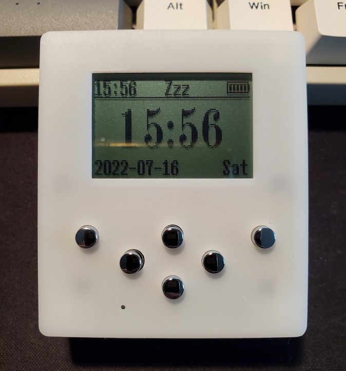

# TimerV2.0
A kittchen timer, mp3 player. STM32F103RET6, W25Q128, RX8025T, NS4168.  

# Feature
### *software decode mp3, i2s output.  
### *16MB spi flash disk.  
### *FATFS format.  
### *DFU Bootloader.  

# Known issues  
### *the USBLC6 (D1) will cost leakage when USB is not connect, can be avoid by disable the 'USB_EN' pin or simply cut the 5' pin of this component.  
### *USB disconnect interrupt can't be detected while device in sleep mode, may fix later.  
### *sometimes return to main UI from the setting menu without expected, may fix later.  

# Note  
This mp3 decode solution is a limited demo, don't use for any business application.  
More info can be found here:  
TimerV2.0/TimerApp/Middlewares/ST/STM32_Audio/Codecs/SpiritDSP_MP3_Dec/Release_Notes.html  
TimerV2.0/TimerApp/Middlewares/ST/STM32_Audio/Codecs/SpiritDSP_MP3_Dec/doc/SpiritMP3Dec_UG.pdf  
